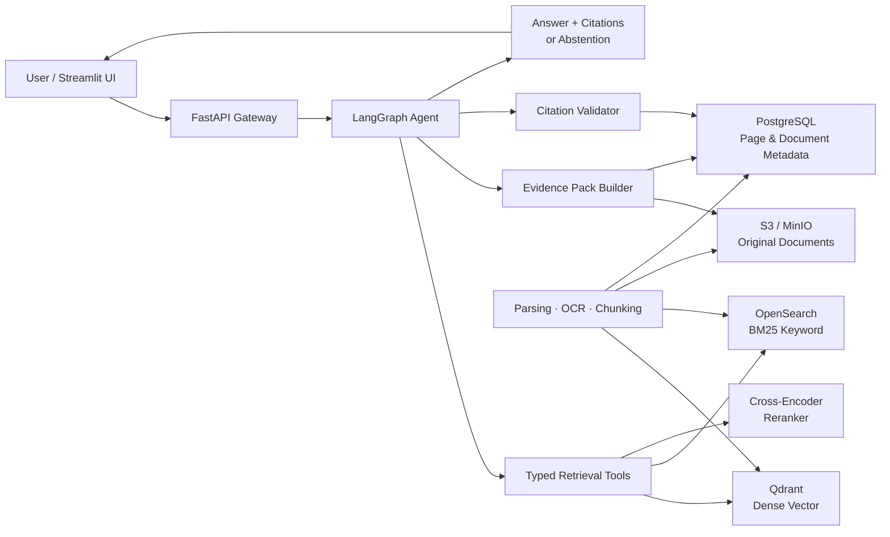

<div align="center">

# Semiconductor Document RAG AI Agent

### From complex semiconductor documents to page-grounded answers

반도체 PDF, 공정 문서, 장비 매뉴얼, 논문을 검색하고<br>
문서 내용을 검색·분석하여 **페이지 단위 근거와 함께 답변하는 Agentic RAG**


</div>

> [!NOTE]
> 현재 프로젝트는 **Agentic RAG 핵심 기능 구현 단계**입니다. 구현 진행 상황과 후속 범위는 [Roadmap](#roadmap)에 계속 반영합니다.

## Documentation

구현 기준과 세부 설계는 [docs/README.md](./docs/README.md)에서 확인할 수 있습니다. 요구사항, 데이터 모델, PDF 처리, Hybrid Retrieval, Agent·도구, API, 평가, 테스트, 운영 및 ADR을 문서별로 관리합니다.

## Overview

반도체 기술 문서는 분량이 길고, 약어·공정명·장비 파라미터가 혼재하며, 필요한 정보가 표·그림·여러 페이지에 흩어져 있습니다. 단순한 의미 기반 검색만으로는 정확한 부품명이나 공정 조건을 놓치기 쉽고, 생성된 답변만으로는 현업에서 근거를 검증하기 어렵습니다.

이 프로젝트는 다음 세 가지 문제를 함께 해결합니다.

1. **찾기** — 한영 용어와 반도체 약어를 고려한 Hybrid Search로 필요한 페이지를 찾습니다.
2. **판단하기** — Agent가 검색, 재검색, 문서 비교, 표 조회 도구를 상황에 맞게 선택합니다.
3. **검증하기** — 모든 핵심 주장에 문서명과 페이지를 연결하고, 근거가 부족하면 답변을 보류합니다.

## Key Features

| 영역 | 기능 |
| --- | --- |
| Document Ingestion | PDF 및 스캔 문서 수집, OCR, 레이아웃·표 파싱, 페이지 메타데이터 보존 |
| Domain-aware Retrieval | 반도체 약어와 한영 동의어를 반영한 Query Expansion |
| Hybrid Search | Dense Vector Search와 BM25 Keyword Search 결합 |
| Reranking | Cross-Encoder 기반 후보 문서 재정렬 |
| Document Intelligence | 문서 요약, 다중 문서 비교, 표 및 원문 페이지 검색 |
| Grounded Answer | 문서명·페이지 기반 인용, 주장과 근거 연결, 원문 확인 경로 제공 |
| Abstention | 근거가 부족하거나 서로 충돌하면 답변을 보류하고 추가 검색 수행 |
| Agentic Retrieval | LangGraph 기반 도구 선택, 조건부 분기, 재검색 및 답변 검증 |
| Agent Safety | Prompt injection 사전 차단, 실행 상한, tool 오류 fallback 및 Citation 복구 |
| Tool Integration | Protocol 기반 내부 도구를 통한 검색·Evidence·Citation 기능 연동 |
| Evaluation | 검색 정확도, 답변 충실성, 인용 정확도, Agent 도구 선택 품질 평가 |

## Example Use Cases

- “두 공정 문서에서 ALD와 CVD의 온도 조건과 막질 특성을 비교하고 근거 페이지를 보여줘.”
- “이 장비 매뉴얼에서 `Vacuum Interlock` 알람의 원인과 조치 절차를 찾아줘.”
- “여러 논문에서 EUV stochastic defect의 주요 원인을 비교하고 각 주장에 출처를 달아줘.”
- “표에 있는 식각 조건 중 선택비가 가장 높은 recipe와 해당 원문 페이지를 보여줘.”

## System Architecture



### Retrieval Flow

```text
질문 분석
  → 반도체 약어·한영 용어 확장
  → Dense + BM25 병렬 검색
  → 결과 융합 및 Reranking
  → 페이지·표 원문 조회
  → 근거 충분성 판단
  → 부족하면 재검색 / 충분하면 인용 답변 생성
  → 주장-인용 정합성 검증
```

## Tech Stack

| Layer | Technology | Purpose |
| --- | --- | --- |
| Language & Runtime | Python 3.11+, uv | 애플리케이션 개발 및 재현 가능한 의존성 관리 |
| API & Schema | FastAPI, Pydantic | 검색·Agent API와 입출력 스키마 정의 |
| Agent Orchestration | LangGraph, LangChain | 상태 기반 워크플로, 조건부 재검색, 도구 실행 |
| Tool Interface | Python Protocol, Pydantic | 검색·근거·인용 기능을 독립적으로 테스트 가능한 내부 도구로 제공 |
| PDF & OCR | Docling, PyMuPDF, PaddleOCR | PDF 레이아웃, 페이지, 표, 스캔 문서 처리 |
| Embedding | Sentence Transformers | 한영 기술 문서용 Dense Embedding |
| Vector Search | Qdrant | Dense Vector 인덱싱 및 유사도 검색 |
| Keyword Search | OpenSearch | BM25 기반 약어, 파라미터, 장비 코드 검색 |
| Reranking | Cross-Encoder Reranker | 검색 후보의 문맥 적합도 재평가 |
| LLM | OpenAI API | 답변 생성, Function Calling, 비교·요약 |
| Metadata | PostgreSQL | 문서, 페이지, 청크, 인용 관계 관리 |
| Object Storage | S3 / MinIO | 원본 PDF 및 파싱 산출물 저장 |
| Evaluation | Ragas, pytest, custom evaluators | 검색·답변·인용·Agent 품질 자동 평가 |
| Observability | Langfuse | LLM·검색 trace, latency, token 사용량 관찰 |
| UI | Streamlit | 검색 결과와 페이지 근거를 확인하는 데모 UI |
| DevOps | Docker Compose, GitHub Actions | 로컬 실행 환경과 CI 자동화 |

### Why This Stack?

- **LangGraph** — 검색 성공 여부와 근거 충분성에 따라 재검색·답변 보류 경로를 명시적으로 제어합니다.
- **Typed Tools** — 문서 검색, Evidence 구성, 인용 검증을 Agent node와 분리하면서 단일 프로세스 MVP의 복잡성을 낮춥니다.
- **Qdrant + OpenSearch** — 의미가 비슷한 문장을 찾는 Dense Search와 정확한 약어·수치·장비 코드를 찾는 BM25의 장점을 결합합니다.
- **페이지 중심 메타데이터** — `document_id`, `page_number`, `section`, `bbox`를 청크와 함께 보존해 답변에서 원문 페이지까지 추적합니다.
- **Reranker + Citation Validator** — 검색 결과의 관련성과 최종 답변의 근거 정합성을 서로 다른 단계에서 검증합니다.

## Target Users

| 사용자 | 제공 가치 |
| --- | --- |
| 반도체 입문자 | 낯선 용어를 풀어 설명하고 원문 근거까지 연결 |
| 취업 준비생 | 공정·장비 문서를 비교하며 직무 지식 탐색 |
| 공정·장비 엔지니어 | 매뉴얼, 조건표, 트러블슈팅 절차를 빠르게 검색 |
| 연구자 | 여러 논문의 주장과 실험 조건을 출처와 함께 비교 |

입문자 지원은 별도의 학습 플랫폼으로 확장하지 않습니다. 동일한 검색 근거를 바탕으로 **입문자 / 취업 준비생 / 실무자 / 연구자** 중 설명 수준을 선택하도록 구현합니다.

## Evaluation Strategy

“그럴듯한 답변”이 아니라 **검색 가능하고 검증 가능한 답변**을 목표로 합니다.

| Evaluation Target | Metrics |
| --- | --- |
| Retrieval | Recall@K, Precision@K, MRR, nDCG@K |
| Reranking | Hit Rate 변화, nDCG 개선 폭 |
| Answer | Faithfulness, Answer Relevancy, Context Precision |
| Citation | Citation Precision, Citation Coverage, Page Match Accuracy |
| Abstention | 근거 부족 탐지 Precision / Recall |
| Agent | Tool Selection Accuracy, Retry Success Rate, 불필요한 Tool Call 수 |
| Operation | p95 Latency, Error Rate, Token Usage |

평가 데이터셋에는 단순 검색 질문뿐 아니라 다중 문서 비교, 표 기반 질문, 상충하는 문서, 답변 불가능 질문을 포함합니다.


## Project Priorities

개발 의사결정은 아래 우선순위를 기준으로 합니다.

1. 문서 처리 품질
2. 검색 정확도
3. 페이지 단위 출처 추적
4. 다중 문서 비교
5. Agent 도구 선택과 재검색
6. 인용 검증
7. 자동 평가와 오류 분석
8. 운영 안정성
9. UI 및 배포
10. 공정 데이터 분석 확장

SQL·Pandas 기반 제조 데이터 분석은 핵심 RAG 파이프라인을 완성한 뒤 추가하는 확장 기능으로 둡니다.

## Data & Copyright

이 저장소에는 재배포 권한이 확인된 샘플 문서만 포함합니다. 외부 논문, 장비 매뉴얼, 사내 공정 문서의 저작권과 사용 권한은 원저작자 및 제공 기관의 정책을 따릅니다. 저장소의 MIT License는 프로젝트 코드에 적용되며, 수집한 문서의 이용 권한을 대신하지 않습니다.

## License

This project is licensed under the [MIT License](./LICENSE).
