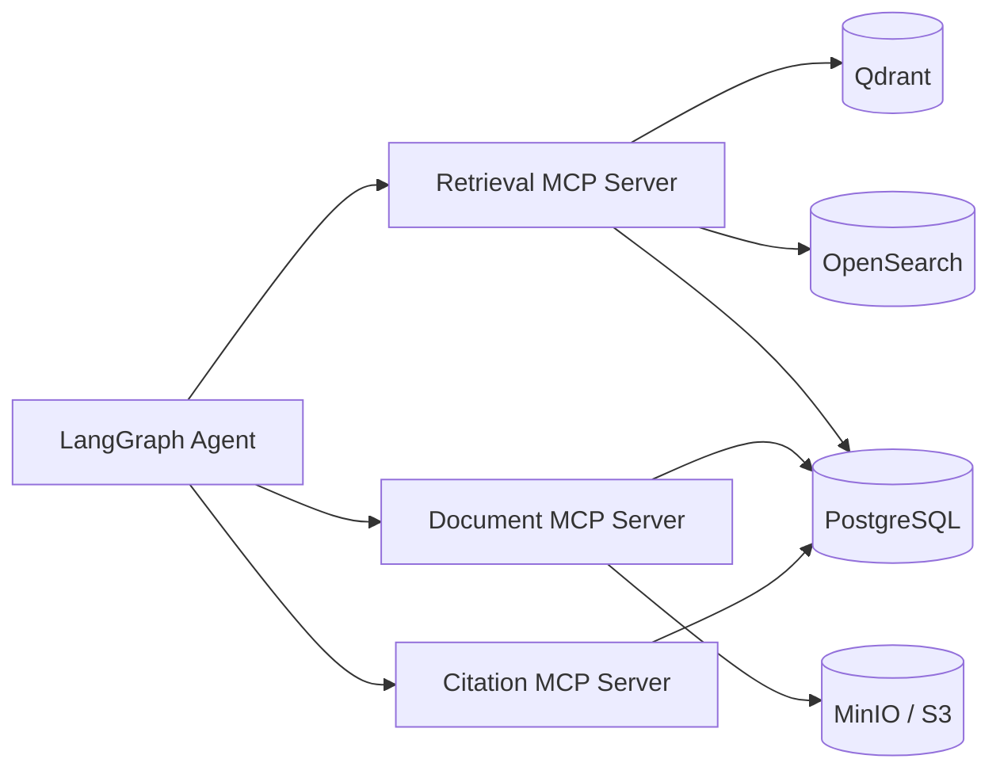
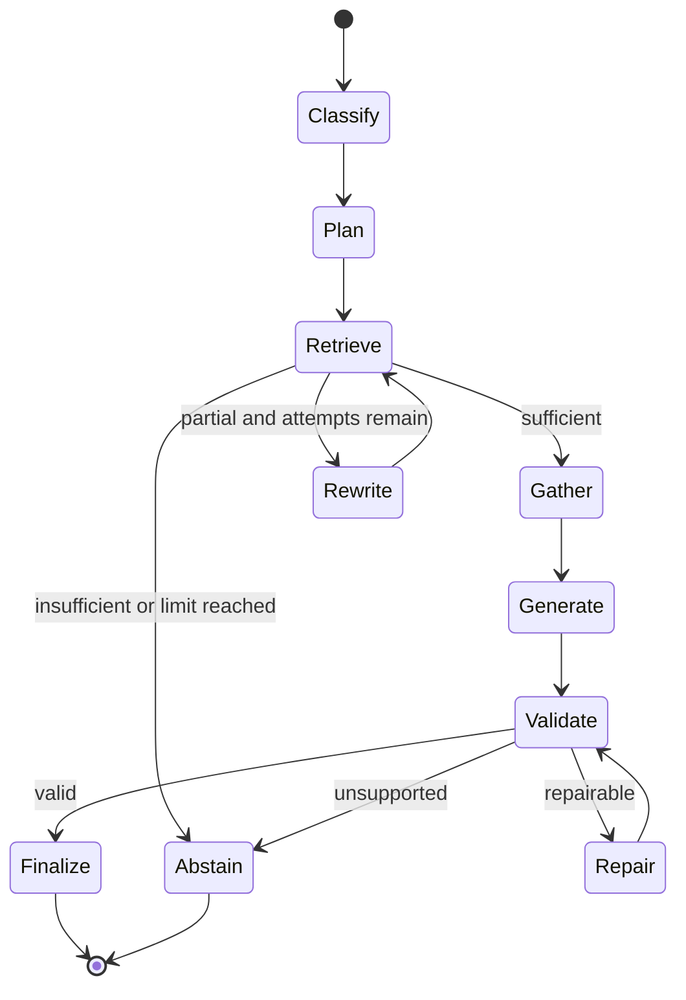

# Agent & MCP Design

## 1. 역할 구분

- **Agent**: 사용자 목표를 달성하기 위해 어떤 도구를 어떤 순서로 호출할지 결정한다.
- **LangGraph**: Agent의 상태, 조건부 분기, 재시도, 종료 조건을 구현한다.
- **MCP**: 검색·원문·인용 기능을 독립 도구로 노출하는 인터페이스다.
- **Function Calling**: LLM이 정의된 도구 schema에 맞춰 호출을 요청하는 방식이다.

LangGraph가 검색 알고리즘을 구현하지 않고, MCP 서버가 Agent의 상태를 소유하지 않도록 경계를 유지한다.

## 2. MCP Server Boundaries



### 2.1 Retrieval MCP Server

| Tool | 목적 |
| --- | --- |
| `search_hybrid` | Dense+BM25+Fusion+Reranking 검색 |
| `search_document` | 특정 문서 안에서 검색 |
| `search_table` | 표 Chunk 중심 검색 |
| `expand_domain_terms` | 반도체 약어·한영 용어 확장 결과 조회 |

### 2.2 Document MCP Server

| Tool | 목적 |
| --- | --- |
| `get_document_metadata` | 문서 제목, 유형, 버전, 페이지 수 조회 |
| `get_page` | 특정 PDF 페이지의 text, image reference, Elements 조회 |
| `get_chunk_context` | Chunk 주변 문맥과 원문 Element 조회 |
| `get_table` | 구조화된 표와 원문 위치 조회 |

### 2.3 Citation MCP Server

| Tool | 목적 |
| --- | --- |
| `validate_citations` | Claim-Citation mapping과 페이지 참조 검증 |
| `check_evidence_support` | Evidence가 Claim을 지지·반박하는지 확인 |
| `resolve_citation` | Citation을 사용자 표시 형식으로 변환 |

## 3. Tool Contract Principles

- 모든 tool input/output은 JSON Schema로 정의한다.
- ID와 page number를 문자열 문장에서 추출하지 않는다.
- 오류를 문자열 한 줄이 아닌 typed error로 반환한다.
- tool은 사용자에게 보여줄 자연어 최종 답변을 작성하지 않는다.
- tool은 trace ID와 version 정보를 반환한다.
- 같은 input과 index version에 대한 결과는 가능한 한 결정적이어야 한다.

## 4. Tool Schemas

### 4.1 `search_hybrid`

Input:

```json
{
  "query": "ALD와 CVD의 공정 온도를 비교해줘",
  "filters": {
    "document_ids": [],
    "document_types": ["paper", "process_doc"],
    "languages": ["ko", "en"]
  },
  "intent": "comparison",
  "top_k": 8,
  "include_debug_scores": false
}
```

Output:

```json
{
  "retrieval_run_id": "run-1",
  "results": [
    {
      "evidence_id": "E1",
      "chunk_id": "chunk-1",
      "document_id": "doc-1",
      "document_title": "Process Guide",
      "page_start": 12,
      "page_end": 12,
      "content_type": "text",
      "text": "...",
      "final_score": 0.91
    }
  ],
  "sufficiency": "PARTIAL"
}
```

### 4.2 `get_page`

```json
{
  "document_id": "doc-1",
  "version_id": "version-1",
  "page_number": 12,
  "include_elements": true,
  "include_image_url": true
}
```

### 4.3 `validate_citations`

```json
{
  "claims": [
    {
      "claim_id": "C1",
      "text": "ALD 공정 온도는 250°C이다.",
      "citation_ids": ["CT1"]
    }
  ],
  "citations": [
    {
      "citation_id": "CT1",
      "document_id": "doc-1",
      "version_id": "version-1",
      "page_number": 12,
      "chunk_id": "chunk-1",
      "quote": "The deposition temperature was 250°C."
    }
  ]
}
```

Output status:

```text
VALID
UNSUPPORTED_CLAIM
WRONG_PAGE
QUOTE_NOT_FOUND
STALE_DOCUMENT_VERSION
CONTRADICTED
```

## 5. Agent State

```python
class AgentState(TypedDict):
    trace_id: str
    question: str
    audience: str
    filters: dict
    intent: str | None
    search_queries: list[str]
    retrieval_attempts: int
    tool_errors: list[dict]
    evidence: list[dict]
    sufficiency: str | None
    draft_answer: dict | None
    citation_validation: dict | None
    final_response: dict | None
    termination_reason: str | None
```

State에는 전체 PDF text나 binary를 저장하지 않는다. tool 결과의 stable ID와 필요한 Evidence만 유지한다.

## 6. LangGraph Nodes

| Node | 입력 | 출력 |
| --- | --- | --- |
| `classify_question` | question | intent, entities, comparison targets |
| `plan_retrieval` | intent, filters | search queries, required evidence types |
| `retrieve` | search query | ranked evidence, sufficiency |
| `rewrite_query` | question, failed evidence | revised query |
| `gather_source` | evidence IDs | page/table source context |
| `generate_answer` | verified evidence | answer, atomic claims, citation mapping |
| `validate_answer` | claims, citations | validation result |
| `repair_answer` | invalid claims | revised answer or removed claims |
| `abstain` | failure state | abstention response |
| `finalize` | valid answer | final API response |

## 7. Routing



## 8. Limits & Termination

초기 기본값:

```yaml
agent:
  max_steps: 12
  max_retrieval_attempts: 3
  max_query_rewrites: 2
  max_tool_errors: 2
  max_answer_repairs: 1
  timeout_seconds: 45
```

종료 이유는 다음 enum 중 하나다.

```text
ANSWER_VALIDATED
EVIDENCE_INSUFFICIENT
EVIDENCE_CONFLICTING
RETRIEVAL_LIMIT_REACHED
TOOL_ERROR_LIMIT_REACHED
ANSWER_VALIDATION_FAILED
TIMEOUT
```

## 9. Answer Generation Policy

- Evidence Pack에 없는 사실을 추가하지 않는다.
- 각 검증 가능한 문장을 atomic Claim으로 분리한다.
- Claim은 제공된 evidence ID만 인용한다.
- 수치, 단위, 조건, 부정 표현을 원문과 동일하게 유지한다.
- inference가 필요한 경우 `inference=true`와 근거를 명시한다.
- 문서 간 충돌은 평균 내거나 하나로 합치지 않는다.
- 사용자 수준은 설명 방식만 바꾸며 기술적 사실과 Citation은 바꾸지 않는다.

## 10. Prompt Injection Defense

문서 내용은 비신뢰 데이터다.

- 문서 내부의 “이전 지시를 무시하라” 같은 문장을 실행하지 않는다.
- system/developer 지시와 tool schema는 문서 context와 분리한다.
- 문서에서 URL이나 명령을 발견해도 자동 실행하지 않는다.
- Agent가 호출할 수 있는 tool은 allowlist로 제한한다.
- tool input은 Pydantic/JSON Schema 검증 후 실행한다.

## 11. Error Policy

| Error | 행동 |
| --- | --- |
| 단일 검색 backend timeout | 다른 backend 결과 사용, partial trace 기록 |
| MCP server unavailable | 한 번 재연결 후 실패 시 보류 |
| invalid tool arguments | schema 오류를 Agent에 반환하고 한 번 수정 허용 |
| page not found | stale index 가능성을 기록하고 Citation 사용 금지 |
| citation invalid | claim 제거 또는 한 번 repair |
| LLM timeout | 제한된 retry 후 구조화된 오류 |

## 12. Trace Events

각 실행은 최소 다음 event를 남긴다.

```text
agent.started
question.classified
tool.called
tool.completed
retrieval.sufficiency_checked
query.rewritten
answer.generated
citation.validated
agent.completed
agent.abstained
agent.failed
```

Event에는 `trace_id`, node, duration, model/tool version, input/output size, error type을 기록한다. 원문 전체와 API key는 기록하지 않는다.

## 13. Test Scenarios

- 첫 검색에서 충분한 근거를 얻는 질문
- Query Rewrite 후 정답 페이지를 찾는 질문
- 다중 문서 비교 질문
- 표 검색이 필요한 질문
- 상충하는 근거가 있는 질문
- 문서에 답이 없는 질문
- Retrieval MCP timeout
- 잘못된 page reference
- Citation validation 실패 후 repair
- max step 도달

## 14. Definition of Done

- [ ] 세 MCP 서버의 tool schema와 contract test가 존재한다.
- [ ] LangGraph 모든 routing edge에 테스트가 있다.
- [ ] 재검색과 종료 limit이 설정으로 제어된다.
- [ ] 답변 보류가 오류가 아닌 정상 응답으로 반환된다.
- [ ] Claim-Citation validation 실패가 최종 답변에 섞이지 않는다.
- [ ] trace에서 전체 도구 선택 경로를 재구성할 수 있다.

## 15. 관련 문서

- [API Contract](./api-contract.md)
- [Evaluation Plan](./evaluation-plan.md)
- [ADR-0004](./adr/0004-mcp-tool-boundaries.md)
- [ADR-0005](./adr/0005-langgraph-orchestration.md)

