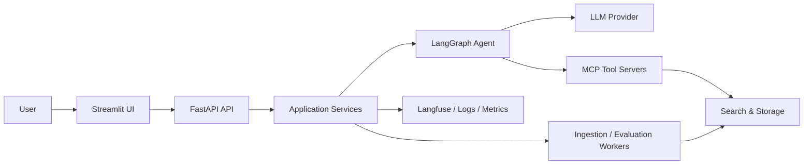
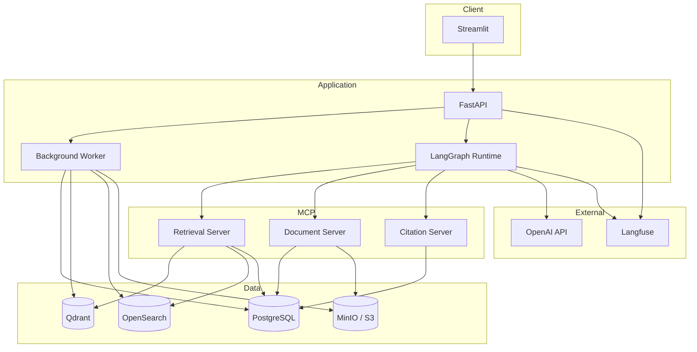
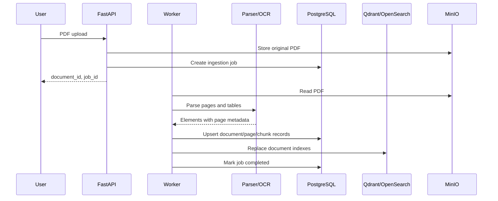
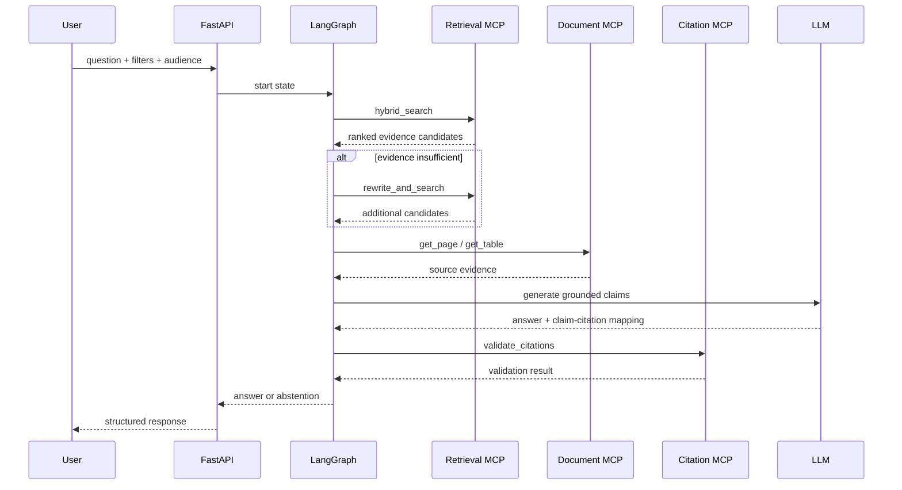

# System Architecture

## 1. 설계 목표

- 페이지 근거를 잃지 않는 문서 처리
- Dense와 Keyword Search를 결합한 정확한 검색
- 검색, 원문 조회, 인용 검증의 독립적인 테스트
- 근거 부족 시 안전하게 종료되는 Agent 흐름
- 로컬 개발과 데모 배포에서 동일한 데이터 계약 사용

## 2. System Context



## 3. Container Architecture



## 4. Component Responsibilities

| Component | 책임 | 하지 않는 일 |
| --- | --- | --- |
| Streamlit UI | 문서 등록, 질문 입력, 답변·인용·원문 표시 | 검색 로직, prompt 조립 |
| FastAPI | 인증 전 단계의 API, 요청 검증, use case 호출 | 파서·DB 세부 구현 |
| Ingestion Worker | 파싱, OCR, Chunking, 색인, 상태 관리 | 사용자 답변 생성 |
| Retrieval Service | Query 처리, Dense/BM25 검색, Fusion, Reranking | LLM 답변 생성 |
| Answer Service | Evidence Pack으로 답변·Claim 생성 | 임의 검색, 원문 조작 |
| Citation Service | Claim과 Evidence 정합성 및 페이지 참조 검증 | 새로운 사실 생성 |
| LangGraph Agent | 도구 순서, 재검색, 종료 조건 제어 | 검색 알고리즘 구현 |
| MCP Servers | 기능을 독립 도구 계약으로 노출 | UI 상태 관리 |
| PostgreSQL | 문서·페이지·청크·작업·인용 메타데이터 | 원본 PDF binary 저장 |
| Qdrant | Dense Vector와 검색용 payload | 원본 문서 보존 |
| OpenSearch | BM25 및 exact term 검색 | 시스템 기록의 source of truth |
| MinIO/S3 | 원본 PDF, 페이지 이미지, 파싱 산출물 | 관계형 조회 |

## 5. 주요 데이터 흐름

### 5.1 Ingestion



색인은 문서 단위로 교체한다. Metadata 저장은 성공했지만 색인이 실패하면 문서 상태를 `INDEX_FAILED`로 기록하고 재시도한다.

### 5.2 Question Answering



## 6. 계층과 의존성 방향

```text
apps (API/UI/MCP entrypoints)
  → application (use cases, ports)
    → domain (entities, policies, pure logic)

infrastructure (DB, search, parser, LLM adapters)
  → application ports 구현
```

- `domain`은 FastAPI, Qdrant, OpenSearch, LangGraph를 import하지 않는다.
- `application`은 구체 DB client 대신 port/protocol에 의존한다.
- `infrastructure`는 외부 SDK 오류를 공통 애플리케이션 오류로 변환한다.
- MCP handler는 application use case를 호출하는 얇은 adapter로 유지한다.

## 7. 목표 디렉터리 구조

```text
.
├── apps/
│   ├── api/
│   ├── ui/
│   └── mcp/
├── src/semiconductor_rag/
│   ├── domain/
│   ├── application/
│   ├── ingestion/
│   ├── retrieval/
│   ├── generation/
│   ├── citation/
│   ├── agent/
│   ├── evaluation/
│   └── infrastructure/
├── tests/
│   ├── unit/
│   ├── integration/
│   ├── contract/
│   ├── evaluation/
│   └── fixtures/
├── configs/
├── data/
│   ├── samples/
│   └── eval/
├── docs/
├── scripts/
└── docker-compose.yml
```

## 8. 상태 모델

### Document Status

```text
UPLOADED
  → PARSING
  → PARSED
  → INDEXING
  → READY

PARSING → PARSE_FAILED
INDEXING → INDEX_FAILED
READY → REINDEXING → READY
```

### Answer Status

```text
SEARCHING
  → GATHERING_EVIDENCE
  → GENERATING
  → VALIDATING
  → COMPLETED

SEARCHING / GATHERING_EVIDENCE / VALIDATING
  → ABSTAINED
```

## 9. Reliability Patterns

- 문서 해시와 파서 설정 버전으로 idempotency key를 생성한다.
- 외부 서비스 호출에는 timeout과 제한된 retry를 적용한다.
- ingestion 단계별 checkpoint를 저장해 실패 지점부터 재시작한다.
- Qdrant와 OpenSearch 색인에는 `document_id`와 `version_id`를 payload로 저장한다.
- 재색인은 새 버전 준비 후 활성 버전을 전환하는 방식으로 수행한다.
- Agent는 `max_steps`, `max_retrieval_attempts`, `max_tool_errors`를 초과하면 답변을 보류한다.

## 10. Security Boundaries

- 업로드 파일명은 저장 경로로 직접 사용하지 않는다.
- MIME type, 확장자, PDF signature, 파일 크기를 검증한다.
- 원문과 인덱스에는 동일한 `access_scope`를 적용할 수 있도록 필드를 예약한다.
- prompt에 삽입되는 문서 내용은 명령이 아닌 비신뢰 데이터로 취급한다.
- 로그에는 원문 전체, API 키, 개인식별정보를 남기지 않는다.

## 11. 주요 Trade-offs

| 선택 | 이점 | 비용 |
| --- | --- | --- |
| Qdrant + OpenSearch 분리 | Dense와 BM25를 독립적으로 튜닝 | 운영 컴포넌트 증가 |
| 페이지 중심 모델 | 인용 추적과 원문 표시가 명확 | 페이지 경계를 넘는 문맥 결합 필요 |
| MCP 서버 분리 | 도구 독립 테스트와 재사용 | 네트워크·serialization 비용 |
| LangGraph | 상태 전이와 종료 조건 명시 | 단순 RAG보다 구현 복잡도 증가 |

## 12. 관련 문서

- [Data Model](./data-model.md)
- [Ingestion Design](./ingestion-design.md)
- [Retrieval Design](./retrieval-design.md)
- [Agent & MCP Design](./agent-mcp-design.md)
- [Operations](./operations.md)

