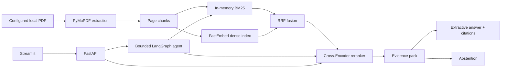
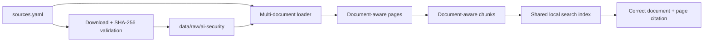

# System Architecture

## 1. 설계 원칙

- 문서와 페이지 식별자를 검색부터 Citation까지 잃지 않습니다.
- 검색 알고리즘과 Agent orchestration을 분리합니다.
- 외부 LLM·DB·검색 서버 없이 로컬에서 재현할 수 있게 유지합니다.
- 새 컴포넌트는 평가에서 현재 병목을 해결한다고 확인될 때만 추가합니다.

## 2. 현재 구조



현재 인덱스는 API 프로세스 메모리에 만들어집니다. BM25는 즉시 준비하고 Dense와 Reranker 모델은 처음 필요할 때 로드합니다. PostgreSQL, Qdrant, OpenSearch, MinIO와 MCP 서버는 사용하지 않습니다.

## 3. 코퍼스 전환 구조



`Multi-document loader` 이후는 다음 구현 범위입니다. 핵심 변화는 Chunk와 Evidence에 실제 `source_id`, 제목, 언어와 PDF 경로를 연결하는 것입니다.

## 4. 컴포넌트 책임

| 컴포넌트 | 현재 책임 |
| --- | --- |
| `scripts/download_corpus.py` | 출처 매니페스트 검증, 공식 PDF 다운로드, 서명·해시 확인, 영수증 기록 |
| `ingestion.pdf` | 네이티브 텍스트 블록과 1-based 페이지 metadata 추출 |
| `ingestion.chunking` | 페이지 범위를 보존한 검색 Chunk 생성 |
| `retrieval` | BM25·Dense·RRF·Rerank와 페이지 추적 검색 결과 생성 |
| `answering` | Evidence 선택, 충분성 판정, 원문 발췌 Claim과 Citation 검증 |
| `agent` | 입력 안전 분류, 검색 순서, 재검색·종료 상한과 trace |
| `apps.api` | HTTP 요청 검증과 현재 단일 문서 서비스 수명주기 |
| `apps.ui` | 질문 입력, 답변·Citation·trace 표시 |
| `evaluation` | 검색·답변·Citation·답변 보류·trajectory 지표 계산 |

## 5. 주요 흐름

### 일반 RAG

```text
question
  → Hybrid 후보 검색
  → Cross-Encoder Rerank
  → 중복 페이지 제거와 Evidence 선택
  → 상위 Rerank 점수 충분성 확인
  → 원문 발췌 Claim 생성
  → Citation의 ID·페이지·quote 검증
  → answer 또는 abstention
```

### Agentic RAG

```text
입력 안전 분류
  → BM25 첫 검색
  → 근거 충분성 판단
  → 필요하면 query rewrite 후 Rerank 검색
  → 답변 생성·검증
  → 성공 또는 제한 사유를 가진 abstention
```

Agent는 검색 알고리즘을 구현하지 않고 typed in-process tool을 호출합니다.

## 6. 신뢰성과 안전 경계

- 다운로드 시 `%PDF-` 서명과 매니페스트 SHA-256을 확인합니다.
- 문서 내용은 명령이 아닌 비신뢰 데이터로 취급합니다.
- Agent는 step·검색·repair·timeout 상한을 넘지 않습니다.
- 답변 인용문은 Evidence 원문에 실제 포함된 경우에만 반환합니다.
- 외부 PDF, 모델 cache, 평가 산출물과 secret은 Git에서 제외합니다.

## 7. 알려진 구조적 제한

- API 서비스가 아직 단일 PDF와 고정 문서 metadata에 묶여 있습니다.
- 인덱스가 프로세스 메모리에 있어 재시작 때 다시 만듭니다.
- 네이티브 텍스트가 없는 페이지는 OCR하지 않습니다.
- 답변은 추출형이며 자연스러운 종합 문장을 생성하지 않습니다.
- 문서 필터와 다중 문서 비교 Evidence 균형이 아직 없습니다.

이 제한은 [Roadmap](./roadmap.md)의 성능 순서로 해결합니다.
