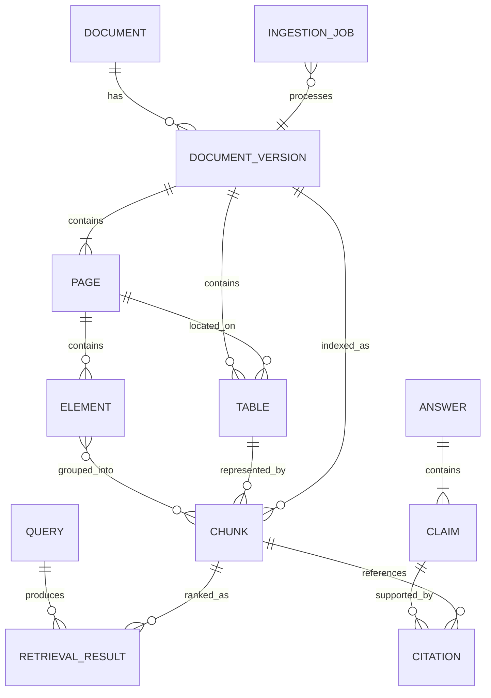

# Data Model

## 1. 목적

검색 결과와 답변 Citation에서 원본 PDF 페이지까지 손실 없이 추적할 수 있는 데이터 계약을 정의한다. PostgreSQL을 metadata source of truth로 사용하고 Qdrant와 OpenSearch는 재생성 가능한 projection으로 취급한다.

## 2. Entity Relationship



## 3. Core Entities

### 3.1 Document

논리적으로 동일한 문서를 나타낸다.

| Field | Type | Rule |
| --- | --- | --- |
| `document_id` | UUID | 영구 식별자 |
| `title` | string | 사용자 표시 제목 |
| `document_type` | enum | `paper`, `manual`, `process_doc`, `datasheet`, `other` |
| `language` | enum | `ko`, `en`, `mixed`, `unknown` |
| `source_uri` | string/null | 허용된 원본 출처 |
| `license_type` | string/null | 문서 이용 조건 |
| `access_scope` | string | MVP 기본값 `public-demo` |
| `created_at` | datetime | UTC |
| `deleted_at` | datetime/null | soft delete |

### 3.2 DocumentVersion

동일 문서의 특정 파일과 파싱 설정 조합을 나타낸다.

| Field | Type | Rule |
| --- | --- | --- |
| `version_id` | UUID | 버전 식별자 |
| `document_id` | UUID | Document FK |
| `content_sha256` | string | 원본 파일 hash |
| `parser_config_hash` | string | 파서·OCR·Chunk 설정 hash |
| `parser_version` | string | 코드 또는 image version |
| `page_count` | integer | PDF 물리 페이지 수 |
| `status` | enum | ingestion 상태 |
| `object_key` | string | 원본 PDF 위치 |
| `is_active` | boolean | 검색 활성 버전 여부 |

`content_sha256 + parser_config_hash`는 동일 처리 요청의 idempotency key로 사용한다.

### 3.3 Page

| Field | Type | Rule |
| --- | --- | --- |
| `page_id` | UUID | 페이지 식별자 |
| `version_id` | UUID | DocumentVersion FK |
| `page_number` | integer | PDF 기준 1-based, 1 이상 |
| `printed_page_label` | string/null | 문서에 인쇄된 페이지 표기 |
| `width` | float | PDF point 또는 정규화 좌표 기준 |
| `height` | float | PDF point 또는 정규화 좌표 기준 |
| `text_coverage` | float | 페이지 면적 대비 text block coverage |
| `ocr_used` | boolean | OCR 사용 여부 |
| `ocr_confidence` | float/null | 0~1 |
| `image_object_key` | string/null | 렌더링 이미지 위치 |

Unique constraint: `(version_id, page_number)`.

### 3.4 Element

파서가 추출한 최소 레이아웃 단위다.

| Field | Type | Rule |
| --- | --- | --- |
| `element_id` | UUID | Element 식별자 |
| `page_id` | UUID | Page FK |
| `element_type` | enum | `title`, `heading`, `paragraph`, `list`, `table`, `caption`, `footer`, `header` |
| `text` | text | 정규화된 텍스트 |
| `reading_order` | integer | 페이지 내 순서 |
| `bbox` | float[4]/null | `[x0, y0, x1, y1]` |
| `parser_confidence` | float/null | 0~1 |
| `metadata` | JSON | parser-specific 최소 정보 |

Header/footer로 판정된 반복 Element는 원문 추적을 위해 저장하되 기본 Chunk에서 제외할 수 있다.

### 3.5 Table

| Field | Type | Rule |
| --- | --- | --- |
| `table_id` | UUID | 표 식별자 |
| `version_id` | UUID | DocumentVersion FK |
| `page_id` | UUID | 시작 페이지 FK |
| `caption` | string/null | 표 제목 |
| `header` | JSON array | 정규화된 열 이름 |
| `rows` | JSON array | 행 데이터 |
| `markdown` | text | 검색·LLM용 직렬화 |
| `bbox` | float[4]/null | 페이지 좌표 |
| `spans_pages` | boolean | 다중 페이지 여부 |

표는 구조화 JSON과 Markdown 표현을 함께 보관한다. 답변 값은 가능하면 행·열 좌표를 Citation metadata로 남긴다.

### 3.6 Chunk

| Field | Type | Rule |
| --- | --- | --- |
| `chunk_id` | UUID | Chunk 식별자 |
| `version_id` | UUID | DocumentVersion FK |
| `chunk_type` | enum | `text`, `table`, `caption` |
| `text` | text | embedding·BM25 입력 |
| `element_ids` | UUID[] | 포함 Element 순서 |
| `page_start` | integer | 1-based |
| `page_end` | integer | 1-based, `page_start` 이상 |
| `section_path` | string[] | 상위 제목 계층 |
| `token_count` | integer | 선택 tokenizer 기준 |
| `content_hash` | string | 중복 검출 |
| `embedding_version` | string/null | 색인 모델 버전 |

#### Chunk Invariants

- `page_start`와 `page_end` 사이의 모든 페이지가 실제 원문에 존재한다.
- 한 Chunk는 기본적으로 한 페이지에 속한다.
- 문장이 페이지 경계를 넘을 때만 최대 두 페이지를 허용한다.
- 표의 행·열 관계는 일반 문단 Chunk와 섞지 않는다.
- Chunk text에 문서명, section path, 표 caption을 context prefix로 추가할 수 있으나 원문 text와 구분한다.

## 4. Query & Retrieval Entities

### Query

```json
{
  "query_id": "uuid",
  "raw_query": "ALD와 CVD 온도 조건을 비교해줘",
  "normalized_query": "ALD CVD deposition temperature condition comparison",
  "expansions": ["atomic layer deposition", "chemical vapor deposition"],
  "filters": {"document_ids": [], "document_type": ["paper"]},
  "audience": "researcher"
}
```

### RetrievalResult

| Field | 설명 |
| --- | --- |
| `query_id` | 검색 요청 |
| `chunk_id` | 후보 Chunk |
| `dense_rank`, `dense_score` | Dense 검색 값 |
| `keyword_rank`, `keyword_score` | BM25 검색 값 |
| `fusion_rank`, `fusion_score` | Fusion 결과 |
| `rerank_score` | Cross-Encoder 점수 |
| `final_rank` | Evidence Pack 순서 |
| `retrieval_run_id` | 설정·모델 버전과 연결 |

서로 다른 검색 엔진의 raw score를 직접 더하지 않는다. 기본 Fusion은 rank 기반 RRF를 사용한다.

## 5. Answer & Citation Entities

### Claim

독립적으로 참·거짓과 근거를 검증할 수 있는 최소 답변 문장이다.

### Citation

| Field | Type | Rule |
| --- | --- | --- |
| `citation_id` | UUID | 식별자 |
| `claim_id` | UUID | Claim FK |
| `chunk_id` | UUID | 근거 Chunk FK |
| `document_id` | UUID | 빠른 표시용 denormalized field |
| `version_id` | UUID | 답변 당시 문서 버전 |
| `page_number` | integer | PDF 1-based 페이지 |
| `quote` | string | 짧은 근거 발췌 |
| `bbox` | float[4]/null | 가능할 때 발췌 위치 |
| `support` | enum | `supports`, `contradicts`, `context_only` |
| `validation_score` | float/null | Citation validator 결과 |

Citation은 반드시 특정 `version_id`를 참조한다. 이후 문서가 재색인되어도 과거 답변의 근거를 재현할 수 있어야 한다.

## 6. Storage Mapping

| Data | PostgreSQL | Qdrant | OpenSearch | Object Storage |
| --- | :---: | :---: | :---: | :---: |
| Document metadata | ✓ | payload | fields |  |
| Original PDF | object key |  |  | ✓ |
| Page metadata | ✓ | payload 일부 | fields 일부 | page image |
| Element | ✓ |  |  | parsed artifact 선택 |
| Chunk text | ✓ | payload | document body |  |
| Dense vector | version metadata | ✓ |  |  |
| BM25 index | version metadata |  | ✓ |  |
| Evaluation run | ✓ |  |  | report artifact |

## 7. Versioning Rules

- Parser, OCR, Chunker, Embedding, Reranker, glossary는 각각 version을 가진다.
- evaluation run에는 Git commit SHA와 모든 component version을 기록한다.
- 모델이나 Chunking 정책이 바뀌면 기존 검색 인덱스를 덮지 않고 새 index version을 생성한다.
- 활성 index alias 전환은 전체 문서 색인과 smoke test가 성공한 후 수행한다.

## 8. Example Evidence Pack

```json
{
  "query_id": "query-1",
  "retrieval_run_id": "run-1",
  "items": [
    {
      "chunk_id": "chunk-1",
      "document_title": "ALD Process Guide",
      "page_start": 12,
      "page_end": 12,
      "section_path": ["Process Window", "Temperature"],
      "content_type": "text",
      "text": "The recommended substrate temperature is ...",
      "rerank_score": 0.91
    }
  ]
}
```

## 9. 관련 문서

- [Requirements](./requirements.md)
- [Ingestion Design](./ingestion-design.md)
- [Retrieval Design](./retrieval-design.md)
- [ADR-0001](./adr/0001-page-centric-evidence-model.md)

