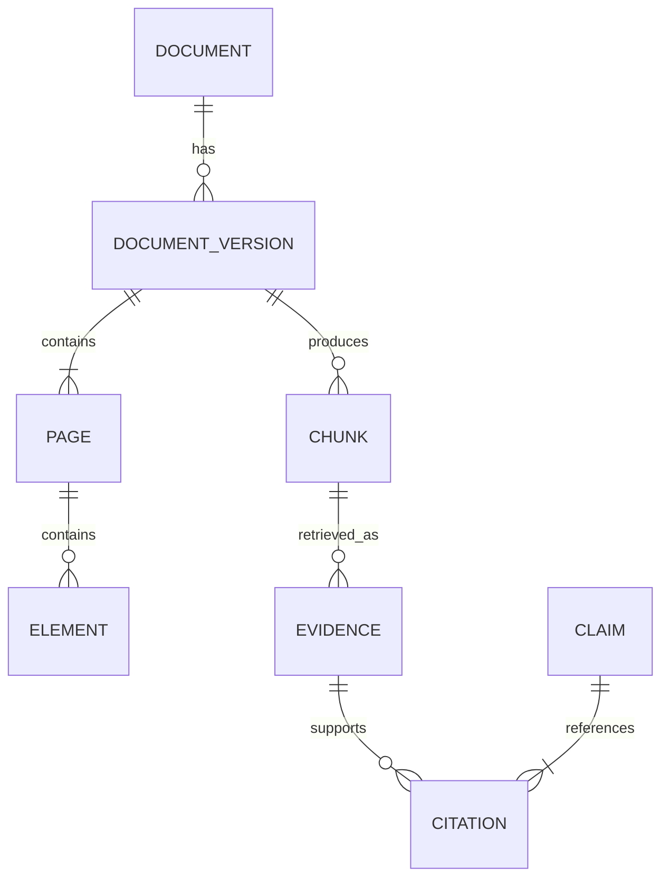

# Data Model

## 1. 목적

검색 결과와 답변이 원본 PDF의 정확한 문서 버전과 물리 페이지로 역추적되도록 하는 데이터 계약을 설명합니다. 현재 객체는 Pydantic 모델이며 영구 DB에는 저장하지 않습니다.

## 2. 현재 핵심 모델



| 모델 | 핵심 필드 | 불변식 |
| --- | --- | --- |
| `Document` | `document_id`, `title`, `document_type`, `language`, `source_uri` | 제목과 식별자가 비어 있지 않습니다. |
| `DocumentVersion` | `version_id`, `content_sha256`, `parser_config_hash`, `page_count` | 해시는 64자 소문자 SHA-256입니다. |
| `Page` | `page_id`, `version_id`, `page_number`, `width`, `height`, `text_coverage` | `page_number`는 1 이상입니다. |
| `Element` | `element_id`, `page_id`, `text`, `reading_order`, `bbox` | 텍스트가 비어 있지 않고 bbox 좌표가 유효합니다. |
| `Chunk` | `chunk_id`, `version_id`, `text`, `page_start`, `page_end`, `content_hash` | `page_end >= page_start`입니다. |
| `EvidenceBlock` | `document_id`, `document_title`, `version_id`, `chunk_id`, `page_number`, `text`, `score` | 한 Evidence는 한 PDF 페이지에 속합니다. |
| `GroundedCitation` | Claim·Evidence·Chunk·Document·Version ID, `page_number`, `quote` | quote가 연결된 Evidence 원문에 포함됩니다. |
| `AgentRun` | 답변, 검색 모드·질의, step, 종료 이유, trace | 종료 이유와 실행 경로를 재구성할 수 있습니다. |

## 3. 식별자와 페이지 규칙

- PDF 페이지 번호는 항상 파일의 1-based 물리 페이지입니다.
- `version_id`에서 `page:{page_number}`로 UUID를 파생합니다.
- `page_id`와 읽기 순서에서 Element UUID를 파생합니다.
- Chunk ID와 content hash는 같은 입력에서 안정적으로 다시 만들어져야 합니다.
- 서로 다른 문서는 페이지 번호가 같아도 `document_id`와 `version_id`로 구분합니다.

## 4. 코퍼스 출처 모델

`data/corpus/sources.yaml`의 각 항목은 다음 정보를 가집니다.

```yaml
id: nist-ai-rmf-1-0
organization: NIST
title: Artificial Intelligence Risk Management Framework (AI RMF 1.0)
language: en-US
landing_page_url: https://doi.org/10.6028/NIST.AI.100-1
download_url: https://nvlpubs.nist.gov/nistpubs/ai/NIST.AI.100-1.pdf
filename: nist_ai_rmf_1_0_en.pdf
expected_page_count: 48
expected_sha256: "..."
excluded_pages: []
license:
  identifier: US-PD
  redistribution: allowed_with_attribution
```

다중 문서 로더는 이 `id`를 검색·Evidence·Citation의 `document_id`로 사용하고 제목과 로컬 파일 경로를 함께 전달해야 합니다.

## 5. 현재와 다음의 차이

| 항목 | 현재 | 후속 |
| --- | --- | --- |
| 문서 수 | 매니페스트 PDF 6개 | 필요성이 확인될 때 확장 |
| 문서 metadata | 출처 매니페스트에서 로드 | 사용자 문서 등록 시 별도 모델 |
| 제외 페이지 | 문서별 `excluded_pages` | OCR 도입 시 재검토 |
| 검색 인덱스 | 메모리 | 메모리 유지, 모든 문서 통합 |
| 영구 저장 | 없음 | 업로드·증분 색인이 필요할 때 검토 |

## 6. Citation 검증 조건

Citation은 다음 조건을 모두 만족해야 합니다.

1. `evidence_id`, `chunk_id`, `document_id`, `version_id`가 선택된 Evidence와 같습니다.
2. `page_number`가 Evidence 페이지와 같습니다.
3. `quote`가 Evidence text의 정확한 부분 문자열입니다.
4. 다중 문서 응답에서는 표시 제목과 PDF 링크가 같은 `document_id`를 사용합니다.

## 7. 후속 확장 조건

현재 규모에서는 DB schema가 필요하지 않습니다. 코퍼스가 메모리 처리 범위를 넘거나 문서 업로드·증분 색인이 필요해질 때만 영구 저장과 인덱스 버전 모델을 별도 ADR로 설계합니다.
