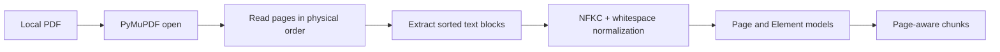

# Ingestion Design

## 1. 목표

공식 PDF의 문서 식별자와 1-based 물리 페이지를 보존하면서 검색 가능한 Chunk를 만듭니다. 현재는 네이티브 텍스트 PDF에 집중하고, OCR과 복잡한 표 파싱은 실제 평가에서 필요한 경우에만 추가합니다.

## 2. 현재 파이프라인



### PDF 추출

- 파일 존재 여부, 암호화 여부와 페이지 수를 검사합니다.
- PyMuPDF의 `blocks` 출력을 읽기 순서로 정렬합니다.
- 텍스트 블록의 bbox와 parser block number를 보존합니다.
- Unicode NFKC와 연속 공백만 정리하고 수치·단위·기호는 유지합니다.
- 물리 페이지 번호는 `index + 1`로 만듭니다.
- 읽을 수 없는 PDF나 페이지는 `PdfExtractionError`로 변환합니다.

### Chunking

- 현재 검색 Chunk는 한 페이지 범위 안에서 만듭니다.
- Chunk는 포함 Element ID, 페이지 시작·끝, token 근사치와 content hash를 가집니다.
- 페이지 전체가 너무 길면 Element 경계를 우선해 나눕니다.
- 답변 Evidence는 여러 페이지를 한 Chunk로 받지 않습니다.

## 3. 코퍼스 수집 계약

`scripts/download_corpus.py`는 인덱싱과 분리된 준비 단계입니다.

1. `data/corpus/sources.yaml`을 Pydantic으로 검증합니다.
2. 공식 `download_url`에서 파일을 받습니다.
3. `%PDF-` signature와 SHA-256을 확인합니다.
4. `data/raw/ai-security/`에 기대 파일명으로 저장합니다.
5. URL, 수집 시각, 파일 크기와 해시를 `download_receipt.json`에 기록합니다.

기존 파일도 매니페스트 해시와 다시 비교합니다. 원격 파일이 바뀌면 자동으로 새 버전을 받아 섞지 않고 실패시킵니다.

## 4. 다음 다중 문서 로더

```text
CorpusSource
  → local PDF path 확인
  → expected page count 확인
  → extract_pdf
  → excluded_pages 제거
  → document metadata를 Chunk에 연결
  → 전체 문서 Chunk를 공유 검색 서비스에 전달
```

다음 구현은 아래 불변식을 지켜야 합니다.

- 로컬 파일이 없거나 해시가 다르면 해당 문서를 조용히 건너뛰지 않습니다.
- 실제 페이지 수가 `expected_page_count`와 다르면 실패합니다.
- `excluded_pages`는 검색에서만 제외하고 원본 파일 페이지 번호를 다시 매기지 않습니다.
- 문서별 version ID는 source ID, 파일 해시와 parser 설정에서 안정적으로 생성합니다.
- 같은 페이지 번호를 가진 다른 문서의 Element와 Chunk가 섞이지 않습니다.

## 5. 확인된 코퍼스 특성

| 기관 | 문서 수 | 페이지 | 네이티브 텍스트 없는 제외 페이지 |
| --- | ---: | ---: | ---: |
| KISA | 3 | 539 | 16 |
| NIST | 2 | 112 | 0 |
| OWASP | 1 | 122 | 0 |
| 합계 | 6 | 773 | 16 |

16쪽은 표지, 이미지 기반 목차, 장 구분 간지 또는 공백으로 시각 확인했습니다. 현재 핵심 본문 검색에는 OCR이 필요하지 않다고 판단합니다.

## 6. 품질 검증

- 기대 페이지 수와 실제 페이지 수
- 빈 페이지·Element·Chunk 수
- 모든 Chunk의 유효한 version ID와 page range
- 제외 페이지가 인덱스에 포함되지 않는지
- 각 문서에서 임의 추출한 페이지 text와 원문 대조
- 같은 입력에서 ID와 content hash가 안정적인지

## 7. 현재 제외한 기능

- OCR 자동 감지와 병합
- 제목 계층·표 구조의 별도 파싱
- 반복 header/footer 자동 제거
- 비동기 job과 영구 저장
- 사용자 업로드와 삭제

이 기능은 파싱 실패 질문과 성능 지표가 필요성을 보여줄 때 추가합니다.
