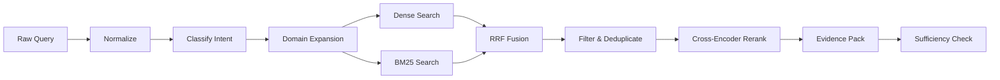

# Retrieval Design

## 1. 목표

의미가 유사한 문장과 정확히 일치해야 하는 반도체 약어·수치·장비 코드를 모두 찾고, 답변 생성에 필요한 페이지 수준 Evidence Pack을 구성한다.

## 2. Retrieval Pipeline



## 3. Query Processing

### 3.1 Normalization

- 앞뒤 공백 및 불필요한 연속 공백 제거
- Unicode NFKC 정규화
- 원래 수치, 단위, 화학식, 장비 코드를 보존
- 필터 조건과 자연어 질문을 분리
- 사용자 질문 원문은 변경하지 않고 별도 필드에 유지

### 3.2 Intent

| Intent | 예시 | 검색 전략 |
| --- | --- | --- |
| fact_lookup | 특정 알람의 원인 | exact term과 관련 page 우선 |
| procedure | 조치 절차 | 순서형 문단과 목록 가중 |
| comparison | ALD와 CVD 비교 | 대상별 검색 후 Evidence group 구성 |
| table_lookup | 최고 선택비 recipe | table Chunk 가중 |
| summary | 문서 핵심 요약 | section coverage 확보 |
| unanswerable_probe | 문서에 없는 사실 | 높은 evidence threshold 적용 |

Intent 분류 실패 시 일반 `fact_lookup`으로 처리하되 원문 질문을 검색한다.

### 3.3 Domain Glossary

```yaml
term_id: process_ald
canonical: atomic layer deposition
aliases:
  - ALD
  - 원자층 증착
  - 원자층증착법
category: deposition_process
case_sensitive: false
```

확장 규칙:

- 원문 query를 항상 유지한다.
- 약어가 모호하면 모든 후보를 무조건 추가하지 않는다.
- 정확한 장비 코드와 수치는 확장하지 않는다.
- expansion term은 retrieval trace에 기록한다.
- 최대 확장어 수를 제한한다.

## 4. Dense Search

### 4.1 Index Input

```text
[Document] {document_title}
[Section] {section_path}
[Type] {chunk_type}
{chunk_text}
```

### 4.2 Qdrant Payload

```json
{
  "chunk_id": "uuid",
  "document_id": "uuid",
  "version_id": "uuid",
  "page_start": 12,
  "page_end": 12,
  "document_type": "manual",
  "language": "en",
  "chunk_type": "text",
  "embedding_version": "model@revision"
}
```

- embedding vector는 cosine similarity를 기본으로 한다.
- document/version/access filter를 vector query에 함께 적용한다.
- query와 document embedding에 동일한 정규화 정책을 사용한다.

## 5. BM25 Search

### 5.1 OpenSearch Fields

| Field | 처리 |
| --- | --- |
| `text` | 한국어·영어 분석기 적용 |
| `text_exact` | keyword/exact 보조 검색 |
| `document_title` | title boost |
| `section_path` | section boost |
| `table_caption` | table query boost |
| `equipment_codes` | exact keyword |
| `units_and_values` | exact/numeric 보조 필드 |

장비 코드, recipe name, chemical formula를 일반 stemming으로 훼손하지 않도록 exact field를 함께 사용한다.

### 5.2 Query Strategy

- 원문 query의 exact phrase
- 분석된 token query
- glossary expansion의 should clause
- intent별 field boost
- document/access filter

raw BM25 score는 Dense score와 직접 합산하지 않는다.

## 6. Fusion

기본 방식은 Reciprocal Rank Fusion이다.

```text
RRF_score(d) = Σ 1 / (k + rank_i(d))
```

초기 기본값:

```yaml
retrieval:
  dense_top_k: 40
  keyword_top_k: 40
  rrf_k: 60
  fusion_top_k: 30
  rerank_top_k: 20
  final_top_k: 8
```

숫자는 초기값이며 [Evaluation Plan](./evaluation-plan.md)의 실험으로 결정한다.

### 6.1 Deduplication

- 동일 `chunk_id`는 하나로 합친다.
- 동일 문서·페이지에서 거의 같은 text는 높은 순위 하나만 유지한다.
- comparison intent에서는 한 문서의 결과가 전체 후보를 독점하지 않도록 문서별 최소·최대 후보 수를 적용할 수 있다.
- 연속 Chunk는 답변 context 구성 단계에서 병합할 수 있으나 개별 검색 점수는 보존한다.

## 7. Reranking

- 입력: `(query, chunk.index_text)` 쌍
- 출력: 관련성 점수와 재정렬 순위
- Fusion 상위 후보에만 적용해 비용을 제한한다.
- 모델 revision과 max token/truncation 설정을 평가 run에 기록한다.
- 표 질의에는 caption, header, row representation을 포함한다.

긴 Chunk가 잘리면 section과 질문에 가까운 문장을 우선 포함한다. 원문 전체는 Citation 단계에서 다시 조회한다.

## 8. Evidence Pack Construction

최종 top-k 결과를 그대로 LLM에 전달하지 않고 다음 규칙으로 Evidence Pack을 만든다.

1. 문서·페이지·section별로 후보를 그룹화한다.
2. 연속 Chunk를 token budget 안에서 결합한다.
3. comparison 대상별 최소 evidence를 확보한다.
4. 표 Chunk는 일반 text와 별도 block으로 표시한다.
5. 각 block에 안정적인 evidence ID를 부여한다.
6. LLM에는 evidence ID, 문서명, 페이지, 원문 text만 제공한다.

```text
[E1]
document: Equipment Manual
page: 42
section: Troubleshooting > Vacuum Interlock
content: ...
```

## 9. Evidence Sufficiency

규칙 기반 신호와 선택적 LLM 판단을 결합한다.

### 신호

- rerank score가 최소 기준을 넘는 후보 수
- 질문의 핵심 entity·term coverage
- comparison 대상별 evidence 존재 여부
- Citation 가능한 페이지 metadata 존재 여부
- 검색 후보 간 상충 여부
- 검색 시도 횟수

### 결과

| 상태 | 행동 |
| --- | --- |
| `SUFFICIENT` | 답변 생성으로 이동 |
| `PARTIAL` | 질의 재작성 또는 문서별 추가 검색 |
| `CONFLICTING` | 양쪽 근거를 유지하고 충돌 답변 생성 |
| `INSUFFICIENT` | 재검색 한도 내 재검색, 이후 답변 보류 |

초기에는 낮은 rerank score 하나만으로 보류를 결정하지 않는다. 평가 데이터로 복합 threshold를 조정한다.

## 10. Search API Result

```json
{
  "query_id": "query-1",
  "retrieval_run_id": "run-1",
  "intent": "comparison",
  "expansions": ["atomic layer deposition", "chemical vapor deposition"],
  "results": [
    {
      "rank": 1,
      "chunk_id": "chunk-1",
      "document_id": "doc-1",
      "document_title": "Process Guide",
      "page_start": 12,
      "page_end": 12,
      "text": "...",
      "scores": {
        "dense": 0.82,
        "bm25": 11.4,
        "rrf": 0.031,
        "rerank": 0.91
      }
    }
  ],
  "sufficiency": "SUFFICIENT",
  "latency_ms": 385
}
```

운영 API에서는 내부 점수를 선택적으로 숨길 수 있지만 평가와 debug 모드에서는 보존한다.

## 11. Evaluation Matrix

동일한 query set에 대해 다음 configuration을 비교한다.

| Run | Dense | BM25 | Expansion | Fusion | Reranker |
| --- | :---: | :---: | :---: | :---: | :---: |
| R1 | ✓ |  |  |  |  |
| R2 |  | ✓ |  |  |  |
| R3 | ✓ | ✓ |  | RRF |  |
| R4 | ✓ | ✓ | ✓ | RRF |  |
| R5 | ✓ | ✓ | ✓ | RRF | ✓ |

R5가 항상 최선이라고 가정하지 않는다. 검색 지표, latency, 비용을 함께 기록한다.

## 12. Failure & Fallback

| Failure | Fallback |
| --- | --- |
| Qdrant timeout | BM25 결과만 반환하고 partial 표시 |
| OpenSearch timeout | Dense 결과만 반환하고 partial 표시 |
| Reranker timeout | Fusion 순위를 사용 |
| Glossary load 실패 | expansion 없이 원문 query 사용 |
| 두 검색 엔진 모두 실패 | 구조화된 tool error, Agent가 제한된 재시도 후 보류 |

## 13. Definition of Done

- [ ] FR-RET-001~008을 검증하는 integration test가 있다.
- [ ] R1~R5 비교 평가가 재현된다.
- [ ] 정답 페이지 기준 Recall@K, MRR, nDCG가 계산된다.
- [ ] exact code, bilingual term, table, comparison 질문이 평가셋에 포함된다.
- [ ] 검색 결과에서 원문 페이지 API로 이동할 수 있다.
- [ ] 모든 모델과 설정 version이 retrieval run에 기록된다.

## 14. 관련 문서

- [Evaluation Plan](./evaluation-plan.md)
- [Agent & MCP Design](./agent-mcp-design.md)
- [ADR-0002](./adr/0002-hybrid-retrieval.md)

