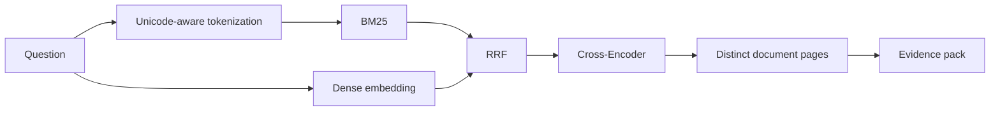

# Retrieval Design

## 1. 목표

한국어·영어 AI 보안 용어의 의미적 유사성과 `AI RMF`, `LLM01`, `prompt injection` 같은 exact term을 함께 찾고, 최종 결과를 정확한 문서와 PDF 페이지로 추적합니다.

## 2. 현재 검색 모드

| 모드 | 구현 |
| --- | --- |
| `bm25` | 로컬 Chunk를 사용한 in-memory BM25 |
| `dense` | FastEmbed 다국어 embedding과 cosine similarity |
| `hybrid` | BM25·Dense 순위를 Reciprocal Rank Fusion으로 결합 |
| `rerank` | Hybrid 상위 후보를 다국어 Cross-Encoder로 재정렬 |

기본 embedding 모델은 `sentence-transformers/paraphrase-multilingual-MiniLM-L12-v2`, 기본 Reranker는 `jinaai/jina-reranker-v2-base-multilingual`입니다. 모델 파일은 Git에서 제외된 `indexes/models`에 지연 로드합니다.

## 3. 검색 흐름



Dense index와 Reranker는 해당 모드를 처음 사용할 때만 준비합니다. 첫 요청 latency와 warm latency를 구분해서 측정합니다.

## 4. 후보 결합과 Reranking

Raw BM25 점수와 cosine 점수는 직접 더하지 않습니다. 각 검색기의 순위를 RRF로 결합합니다.

```text
RRF(d) = Σ 1 / (k + rank_i(d))
```

`rerank` 모드는 `max(top_k, rerank_candidate_k)`개의 Hybrid 후보를 만들고, Cross-Encoder 점수로 다시 정렬해 `top_k`를 반환합니다.

## 5. Evidence 선택

- 질문 token과 전혀 겹치지 않는 결과는 Evidence에서 제외합니다.
- 같은 문서 버전의 같은 페이지는 한 번만 유지합니다.
- Evidence에는 문서 ID·제목, version ID, chunk ID, 페이지, 원문과 검색 점수를 저장합니다.
- Rerank 결과의 최상위 점수가 현재 threshold보다 낮으면 답변을 보류합니다.
- 최종 Claim은 질문 개념을 새로 덮는 원문 문장을 우선 선택합니다.

현재 threshold는 기존 단일 문서 평가로 정한 값입니다. 새 AI 보안 평가셋에서 반드시 다시 보정해야 합니다.

## 6. 다중 문서에서 추가할 규칙

- 모든 Chunk에 실제 corpus source ID와 제목을 연결합니다.
- 검색 필터는 `document_ids`, 기관과 언어를 지원합니다.
- 비교 질문은 한 문서의 결과가 후보를 독점하지 않도록 문서별 Evidence를 확보합니다.
- 한영 교차 검색 실패를 별도 slice로 측정합니다.
- 표지·목차·반복 header처럼 답변을 오염시키는 페이지는 제외합니다.

## 7. 평가 순서

동일한 질문과 Chunk 집합에서 다음 구성을 비교합니다.

| Run | BM25 | Dense | RRF | Rerank |
| --- | :---: | :---: | :---: | :---: |
| R1 | ✓ |  |  |  |
| R2 |  | ✓ |  |  |
| R3 | ✓ | ✓ | ✓ |  |
| R4 | ✓ | ✓ | ✓ | ✓ |

주요 지표는 Page Hit@5, Recall@5, MRR, Citation Page Match Accuracy와 warm latency입니다. 모델이나 후보 수는 한 번에 하나씩 바꾸고 holdout 결과로 선택합니다.

## 8. 실패 유형

| 유형 | 의미 | 우선 대응 |
| --- | --- | --- |
| `missed` | 정답 페이지가 후보에 없음 | Chunk·embedding·BM25 분석 |
| `low_rank` | 정답은 있으나 Top-K 밖 | Fusion·후보 수 조정 |
| `wrong_page` | 관련 문서지만 근거 페이지가 다름 | Chunk·Evidence 선택 개선 |
| `rerank_regression` | Reranker가 정답 순위를 낮춤 | 모델·입력 길이·후보 분석 |
| `cross_language` | 한영 교차 질문에서 실패 | 다국어 모델·용어 확장 비교 |
| `document_imbalance` | 비교 질문에서 한 문서만 검색 | 문서별 diversity 규칙 |

검색 인프라를 외부 서비스로 옮기는 것은 데이터 규모나 latency가 로컬 구조의 한계를 실제로 넘은 뒤 검토합니다.
